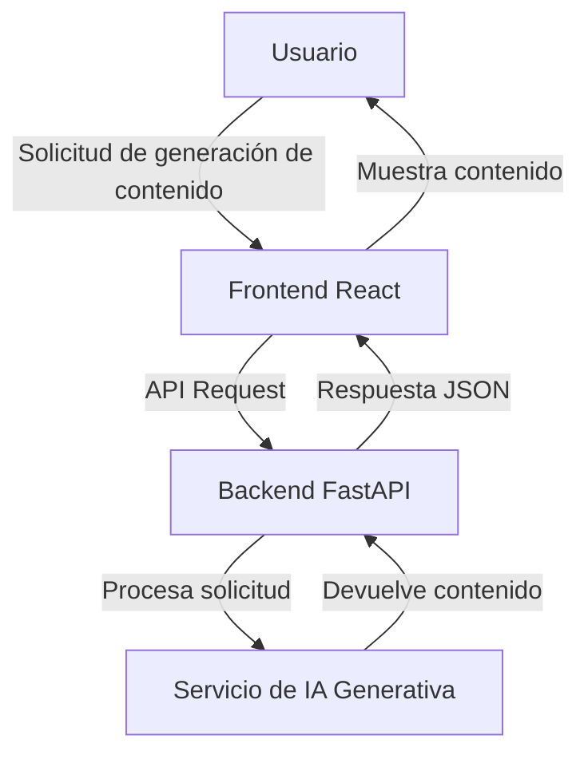
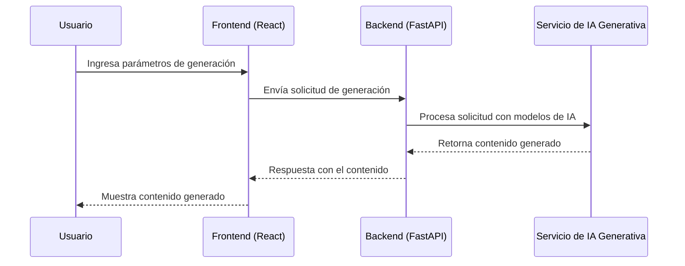

# Plataforma de Generación de Contenido Personalizado mediante IA Generativa

Este repositorio contiene una aplicación full stack basada en microservicios para la generación de contenido personalizado utilizando IA generativa. La arquitectura está dividida en tres microservicios: un backend en Python con FastAPI, un frontend desarrollado con React y Express.js, y un microservicio de IA generativa. Todo el sistema está desplegado mediante Docker y orquestado usando Docker Compose.

## Tabla de Contenidos
- [Arquitectura](#arquitectura)
- [Servicios](#servicios)
  - [Backend en Python (FastAPI)](#backend-en-python-fastapi)
  - [Frontend con React y Express](#frontend-con-react-y-express)
  - [Servicio de IA Generativa](#servicio-de-ia-generativa)
- [Despliegue](#despliegue)
  - [Prerequisitos](#prerequisitos)
  - [Ejecutar Localmente](#ejecutar-localmente)
- [Diagramas](#diagramas)
  - [Diagrama de Arquitectura](#diagrama-de-arquitectura)
  - [Diagrama de Secuencia](#diagrama-de-secuencia)
- [Tecnologías Utilizadas](#tecnologías-utilizadas)
- [Contribuciones](#contribuciones)

## Arquitectura

La aplicación está diseñada en una arquitectura de microservicios, donde cada componente funciona de manera independiente y está empaquetado en su propio contenedor Docker. Esto facilita la escalabilidad y el mantenimiento del proyecto.

## Servicios

### Backend en Python (FastAPI)

El backend desarrollado con **FastAPI** actúa como el núcleo de la aplicación, gestionando las solicitudes de los usuarios y coordinando la comunicación con el servicio de IA Generativa.

- **Funcionalidades:**
  - Procesamiento de solicitudes de generación de contenido.
  - Autenticación y autorización de usuarios.
  - Coordinación con el servicio de IA para procesar las peticiones.

- **Endpoints principales:**
  - `/generate`: Punto de acceso para la generación de contenido.
  - `/login`: Autenticación de usuarios.

### Frontend con React y Express

El frontend permite la interacción con los usuarios. El usuario puede ingresar sus solicitudes a través de una interfaz moderna y amigable desarrollada en **React**, mientras que **Express** se encarga de servir la aplicación.

- **Funcionalidades:**
  - Formulario de ingreso de parámetros para la generación de contenido.
  - Visualización del contenido generado.
  - Manejo de sesiones de usuarios.

### Servicio de IA Generativa

Este microservicio se encarga de procesar las solicitudes de los usuarios y utilizar modelos de IA generativa, como **GPT-3** para texto, **DALL·E** para imágenes, o **Codex** para generar código.

- **Funcionalidades:**
  - Uso de APIs de IA para la generación de contenido personalizado.
  - Escalabilidad para manejar varias solicitudes simultáneas.

- **Modelos utilizados:**
  - **GPT-3**: Generación de contenido textual.
  - **DALL·E**: Generación de imágenes personalizadas.
  - **Codex**: Generación de código en base a descripciones del usuario.

## Despliegue

### Prerequisitos
- **Docker** instalado en tu máquina.
- **Docker Compose** para la orquestación de los contenedores.

### Ejecutar Localmente

Para ejecutar la aplicación en tu máquina local, sigue los siguientes pasos:

1. Clona este repositorio:
   ```bash
   git clone https://github.com/usuario/plataforma-ia-generativa.git
   cd plataforma-ia-generativa
   ```
2. Construye los contenedores Docker:
   ```bash
   docker-compose build
   ```
3. Levanta los servicios:
   ```bash
   docker-compose up
   ```

La aplicación estará disponible en `http://localhost:3000`.

## Diagramas

### Diagrama de Arquitectura



### Diagrama de Secuencia



## Tecnologías Utilizadas

- **Backend:** Python, FastAPI
- **Frontend:** React, Express.js
- **IA Generativa:** GPT-3, DALL·E, Codex (APIs de OpenAI)
- **Contenedores y Orquestación:** Docker, Docker Compose
- **Base de Datos:** PostgreSQL (para almacenar usuarios y contenidos generados)

## Contribuciones

Si deseas contribuir a este proyecto, puedes hacer un fork del repositorio y enviar un pull request. Toda contribución es bienvenida, incluyendo mejoras en la documentación, nuevas funcionalidades o corrección de errores.

1. Haz un fork del proyecto.
2. Crea una nueva rama (`git checkout -b feature-nueva`).
3. Realiza tus cambios y haz commit (`git commit -m 'Agrega nueva funcionalidad'`).
4. Envía un pull request.

## Licencia

Este proyecto está bajo la licencia MIT. Consulta el archivo [LICENSE](LICENSE) para más información.

---

Con esta documentación, espero que puedas instalar, utilizar y contribuir a la plataforma de generación de contenido personalizado utilizando IA generativa sin mayores complicaciones. Si tienes preguntas o sugerencias, no dudes en crear un issue en el repositorio.

